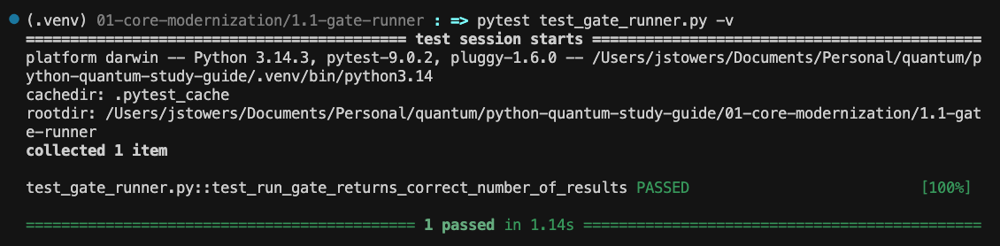

# Core Modernization

Tuesday, March 10, 2026

## Topics

1.1 Type hints and annotations

1.2 Data classes and structured configuration

1.3 Pathlib - modern file paths

1.4 Context managers

## Unit Tests

I use `pytest` for unit tests.

To run a specific unit test, go to the folder for that exercise and specify the test file and verbose `-v` output

```bash
pytest test_gate_runner.py -v
```

## Test Passes

If the test passes, you will see output like:




### Test Fails

If the test fails, you will see output like:

