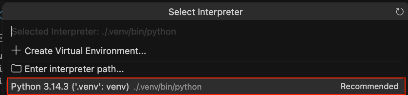

# python-quantum-study-guide

This Python repository provides a study guide for applying to a `quantum software engineer` role that is focused on modernizing, refactoring, testing, and tuning legacy or existing Python codebases.

## Four-Week Study Guide

__Week 1: Core Modernization__

1.1 - add type hints and annotations to a legacy gate runner

1.2 - data classes and structured configuration

Week 2 - Async & Pattern Matching

Week 3 - Profiling & NumPy Vectorisation

Week 4 - Numba, Memory & Parallelism

## Virtual Environment Setup

A _virtual environment_ is an isolated Python installation for a specific project.  The virtual environment for this project is `.venv`.

The `.venv` folder contains its own isolated copy of Python and `pip`, the Python package manager.  This ensures that any packages installed for this project, like `numba`, `pytest`, and `numpy`, do not impact or conflict with any other project.

You have two options to activate the virtual environment:

1. Cursor command palette

2. Terminal

### 1. Cursor command palette

Click `Cmd + Shift + P` to open the Cursor command palette.

Search for "Python: Select Interpreter".

Select the one that shows `.venv`:



### 2. Terminal

To activate the virtual environment from the terminal:

```bash
source .venv/bin/activate
```

### Auto Activation in New Terminals

Click `Cmd + Shift + P` to open the Cursor command palette.

Search for "Preferences: Open User Settings (JSON)"

In the JSON file, add this set to the list:

```json
"python.terminal.activateEnvironment": true
```

### Deactivate Virtual Environment

To kill the virtual environment, close the terminal or type this command:

```bash
deactivate
```

## Unit Tests

The `pytest` configuration file is `conftest.py`.  It runs automatically before the test suite.

To run all unit tests from the terminal with verbose (`-v`) output:

```bash
pytest tests/ -v
```